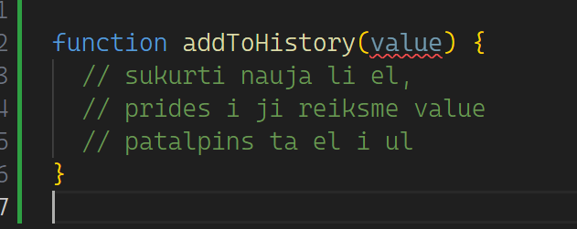

# Practice

1. CAO visus iskyrus literal-types.ts
2. calc.ts uzd 
3. calc.ts jei pasirinktas antras skaicius yra 0 ir veiksmas dalyba - pranesti rezultato paragrafe kad dalyba is
   nulio negalima ir neskaiciuoti su calculate
